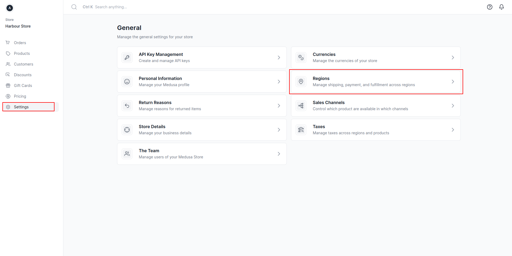
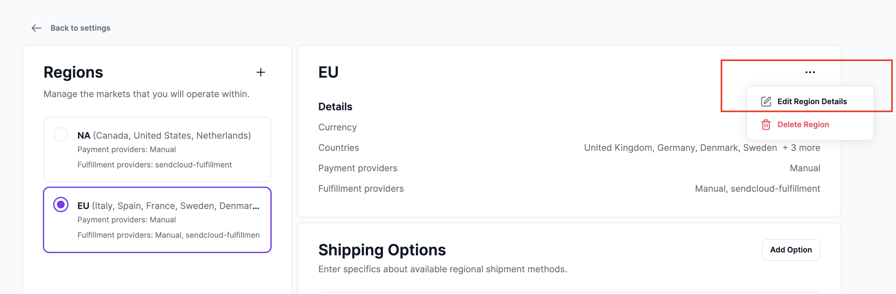
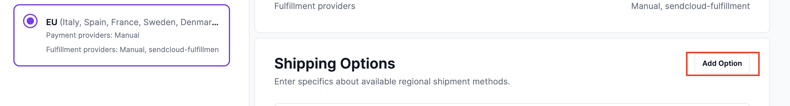
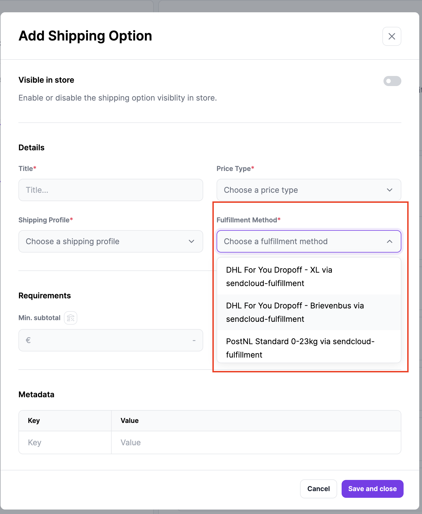
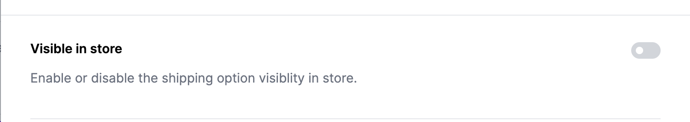
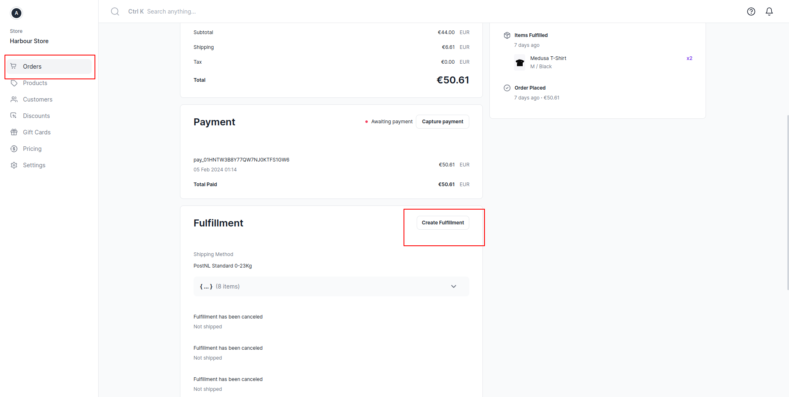
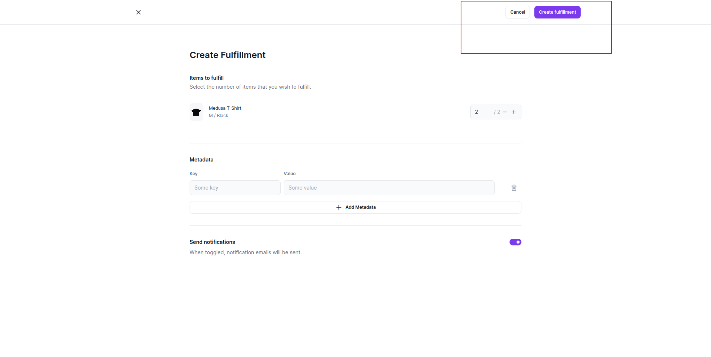
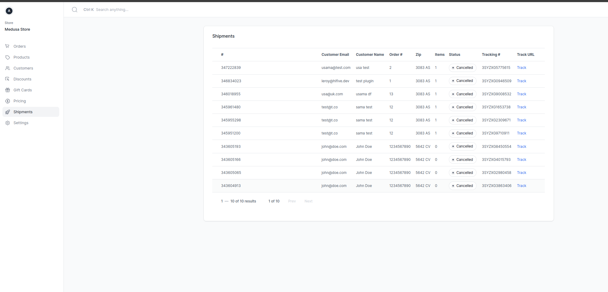
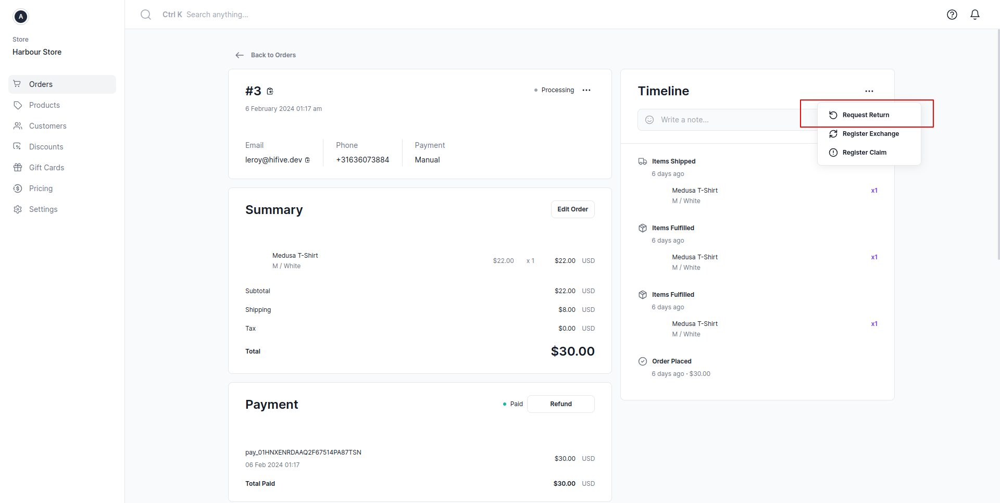
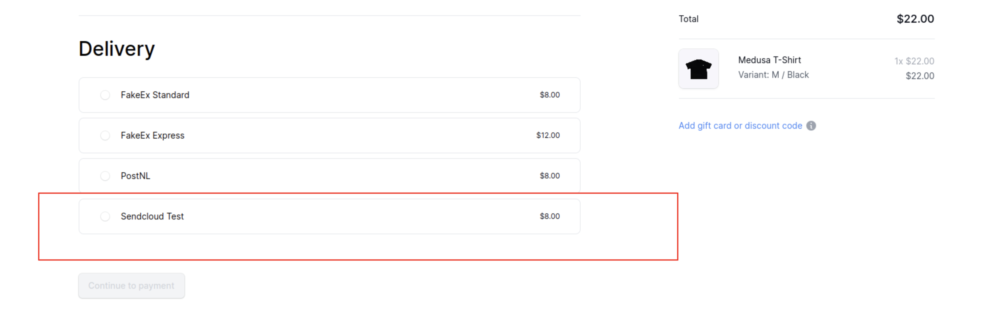

# Medusa - SendCloud Integration Plugin

## Project Description
This plugin integrates Medusa, a powerful headless commerce engine, with SendCloud, a comprehensive shipping and fulfillment service, enabling automated shipping and tracking for Medusa-powered online stores.

## Features
- Automated shipping label creation.
- Real-time tracking updates.
- Seamless integration with Medusa's cart and checkout modules.
- Support for SendCloud's parcel and return portal features.

## Prerequisites
- A Medusa project setup:
    - Server / Admin (https://docs.medusajs.com/deployments/server/)
    - Storefront (https://docs.medusajs.com/starters/nextjs-medusa-starter - https://docs.medusajs.com/deployments/storefront/)
- A SendCloud account:
    - API key (https://sendcloud.dev/docs/getting-started/)
    - For returns a return address (https://sendcloud.dev/docs/returns/return-portal/)

## Installation

Please install the plugin through these commands in your terminal and in the project directory.

```js
yarn add medusa-fulfillment-sendcloud
yarn build
```

## Configuration
Detailed steps on configuring the plugin with your Medusa project and SendCloud account, including setting up API keys and tokens.

- Goto admin panel, and regions section open your desired region in which you want your users to use sendcloud as fulfillment.




- Edit region, and add the sendcloud fulfillment provider.




- Then in the shipping options, add a shipping option by providing the relevant details and selecting one of the shipping methods from sendcloud.




- Check the 'visible in store' option



- similarly add a return shipping option.

## Usage
**Creating Shipping Labels**:
- Opening the Order Details Page: Access the specific order for which you want to create a shipping label.
- Navigating to the Fulfillment Section: Locate the section dedicated to fulfillment within the order details.

 


- Creating a Fulfillment: Use the provided interface to specify the details of the fulfillment, such as the quantity of items and the location from which they will be shipped.



- Marking Fulfillment as Shipped: After creating the fulfillment, mark it as shipped and provide tracking information.

**Tracking Shipments**:

Steps to track order shipments in real-time.
- Select the shipments menu in the admin panel sidebar and click track link for the specific shipment to see tracking info.
 

      
**Handling Returns**:
- Open the specific order page and in the timeline section menu, users can request return.



## Implementing Components in the Storefront (Next.js Example)

- After installing the plugin and adding shipping methods from the admin panel, the shipping methods will automatically appear in the checkout form in store.



## Prepare

**In the medusa.config.js file in backend, you have to include the following in the plugins array**

```js
{
    resolve: `medusa-fulfillment-sendcloud`,
    options: {
        token: "<API_KEY_FOR_SENDCLOUD>",
        enableUI: true,
    },
}
```

## Testing

SendCloud offers no sandbox. If you are testing please notice that there are free and paid shipping options in your account. There is a unstamped label option in the platform which is free and which is recommended for testing.

Once your integration is working you can check with paid shipping methods, but make sure that you cancel them before the cancellation deadline otherwise you have to pay for this label on the next invoice.

## Troubleshooting
Common issues and solutions when using the plugin.

- During checkout in the store, in the address field, there must be house # added. It requires user to include some digits in the address to pick the house number.

## Support and Contact
Information for support and contacting the maintainers.
- support@hifive.dev